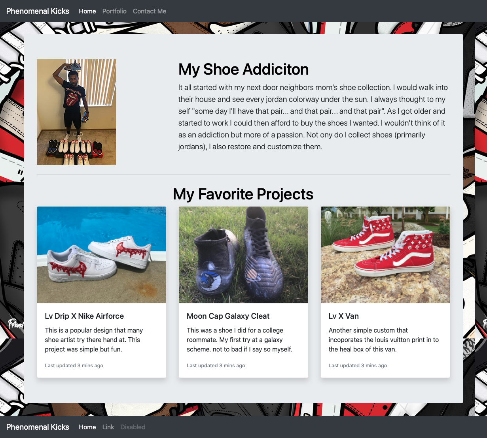

# Bootstrap Personal Portfolio Webpage 

## Description
Here I have created a personal portfolio using bootstrap. To view my page visit here https://devontehillman.github.io/portfolio/ This we page consists of: 
* A responsive layout.
* Responsive images.
* A linked navbar.
* Cards. 
* Contact Fourm.
* Bootstrap's grid system.

## Finished-Page

## What did I learn?
In this project I learned:
* How to use bootstap.
* How to customize certain bootstrap web pages. 
* How to use github branches for version control.
* How to use custom .
* Problem solving for bootstraps.

## Future improvments?
* Add and improve semantic tags.
* Add photo carousel for portfolio photo page.
* Connecting contact fourm to a live server.

## Recent Updates
* Added photo fiters 
* Reformatted Nav
* Included Social Media link 
* Added font Awesome Icons 